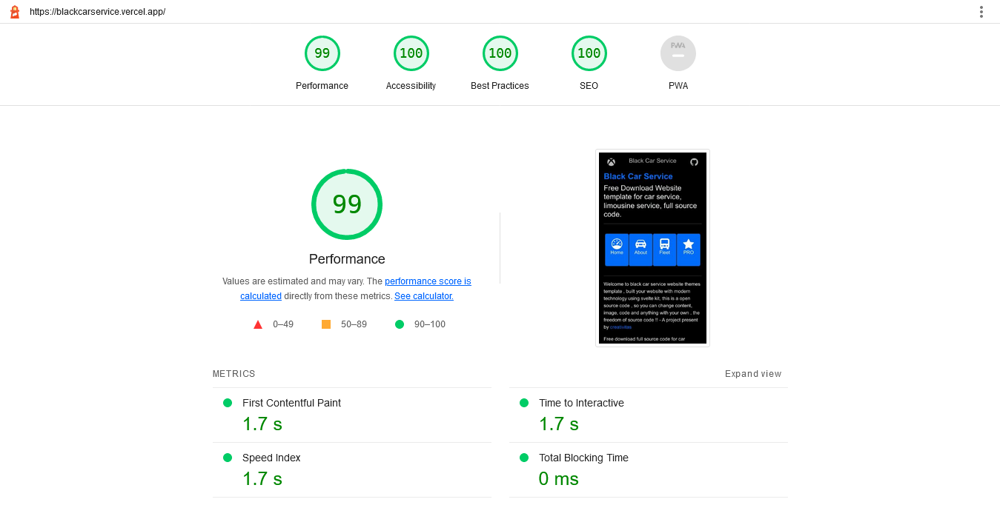
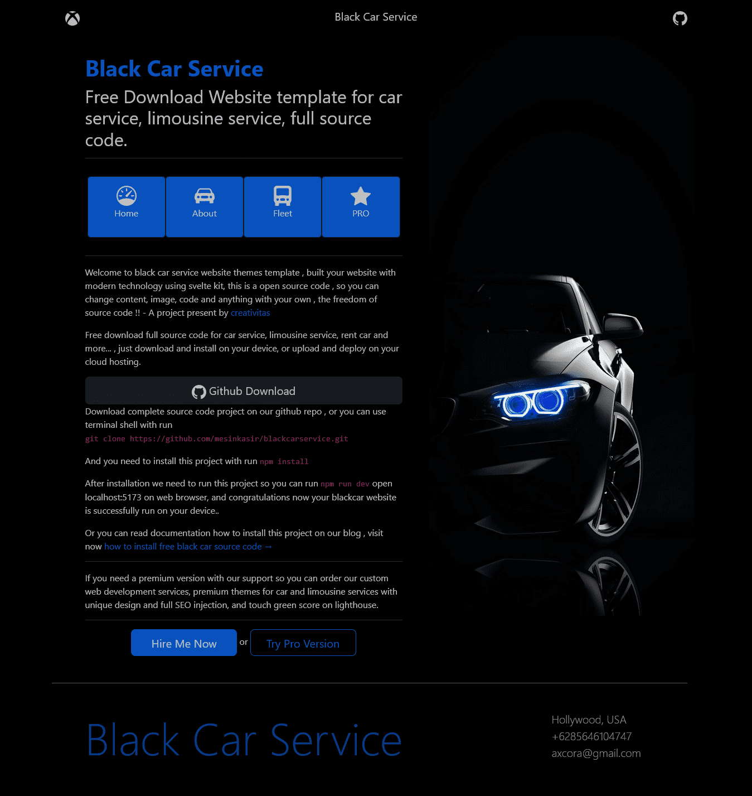
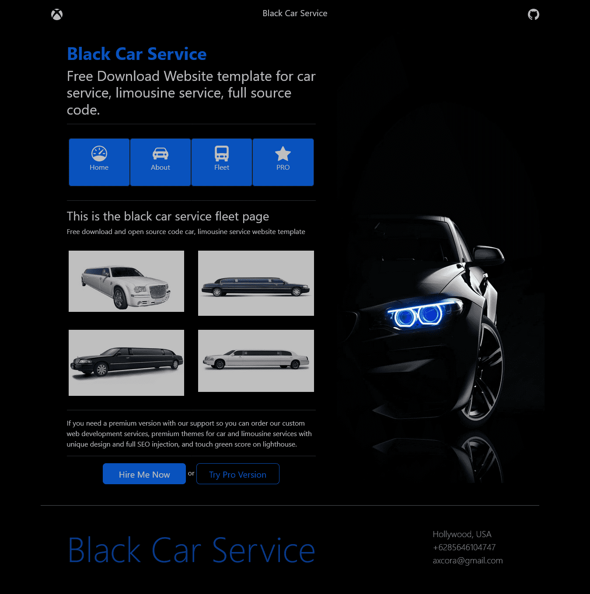

# BLACK CAR SERVICE WEBSITE TEMPLATE

https://grandlimousine.axcora.com/

Demo : [https://blackcarservice.vercel.app](https://blackcarservice.vercel.app/)

Demo SSG : [https://blackcar.axcora.com](https://blackcar.axcora.com)

Premium Sveltekit car : [https://cybercar.vercel.app](https://cybercar.vercel.app)

Premium Sapper car : [https://limousinewebsite.vercel.app/](https://limousinewebsite.vercel.app/)

Car site with gatsby : [https://limoweb.vercel.app](https://limoweb.vercel.app)

Video demo [https://youtu.be/-3PY545EgBM](https://youtu.be/-3PY545EgBM)

Documentation : [https://www.hockeycomputindo.com/2022/07/blackcar-service-free-template-download.html](https://www.hockeycomputindo.com/2022/07/blackcar-service-free-template-download.html)

<a href="https://www.buymeacoffee.com/axcora"></a>

---------------------------------------------



Lighthouse report



Home Page



Fleet Gallery


Mobile display


------------------------------


built with sveltekit feat vite
+ bootstrap
+ svelte:head SEO
+ JSON file

Demo : [https://blackcarservice.vercel.app](https://blackcarservice.vercel.app/)

Demo SSG : [https://blackcar.axcora.com](https://blackcar.axcora.com)

Premium Sveltekit car : [https://cybercar.vercel.app](https://cybercar.vercel.app)

Premium Sapper car : [https://limousinewebsite.vercel.app/](https://limousinewebsite.vercel.app/)

Car site with gatsby : [https://limoweb.vercel.app](https://limoweb.vercel.app)


Documentation : [https://www.hockeycomputindo.com/2022/07/blackcar-service-free-template-download.html](https://www.hockeycomputindo.com/2022/07/blackcar-service-free-template-download.html)


Video demo [https://youtu.be/-3PY545EgBM](https://youtu.be/-3PY545EgBM)


--------------------------------


# create-svelte

Everything you need to build a Svelte project, powered by [`create-svelte`](https://github.com/sveltejs/kit/tree/master/packages/create-svelte).

## Creating a project

If you're seeing this, you've probably already done this step. Congrats!

```bash
# create a new project in the current directory
npm init svelte

# create a new project in my-app
npm init svelte my-app
```

## Developing

Once you've created a project and installed dependencies with `npm install` (or `pnpm install` or `yarn`), start a development server:

```bash
npm run dev

# or start the server and open the app in a new browser tab
npm run dev -- --open
```

## Building

To create a production version of your app:

```bash
npm run build
```

You can preview the production build with `npm run preview`.

> To deploy your app, you may need to install an [adapter](https://kit.svelte.dev/docs/adapters) for your target environment.
